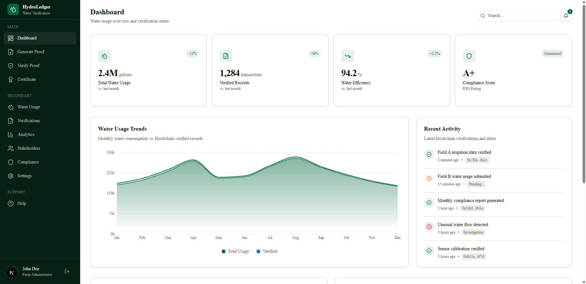
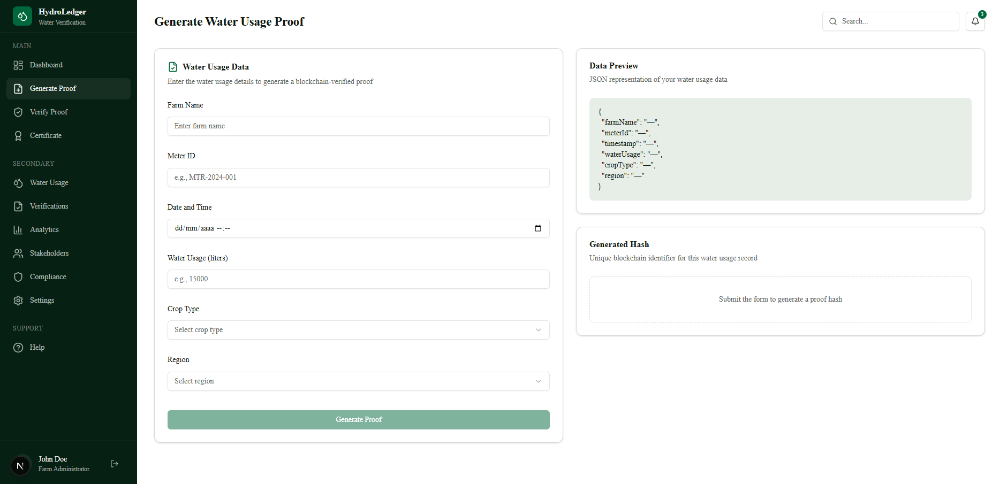
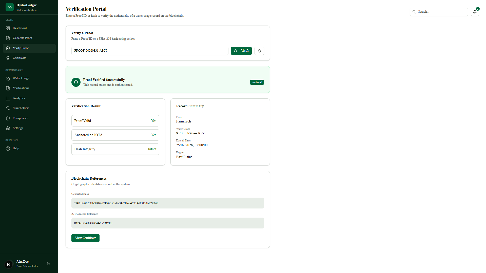
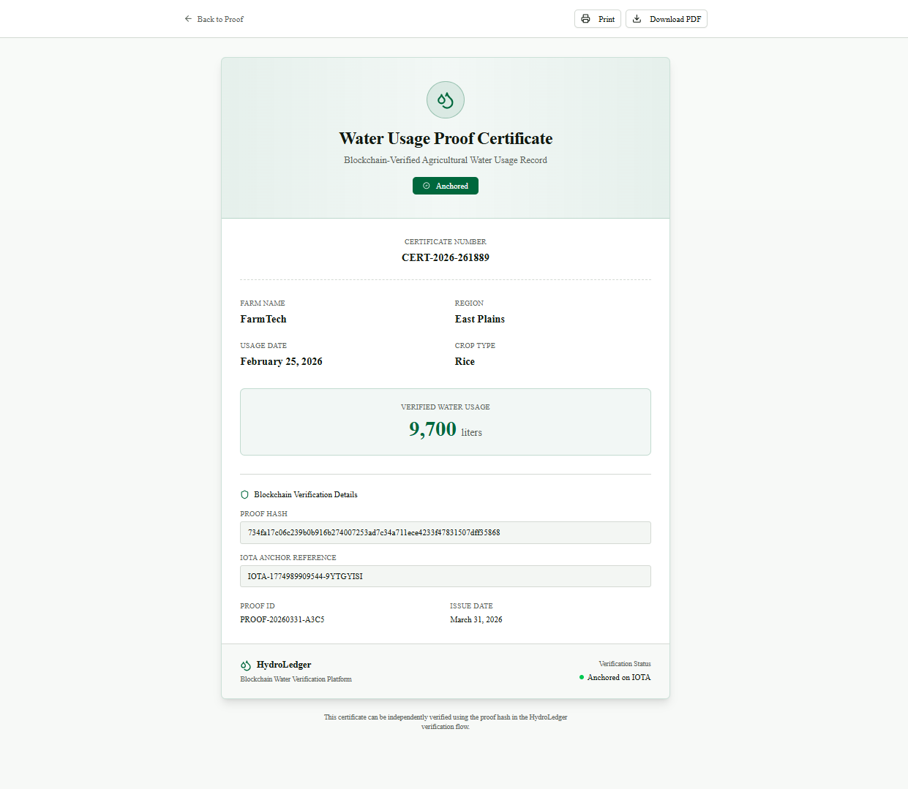
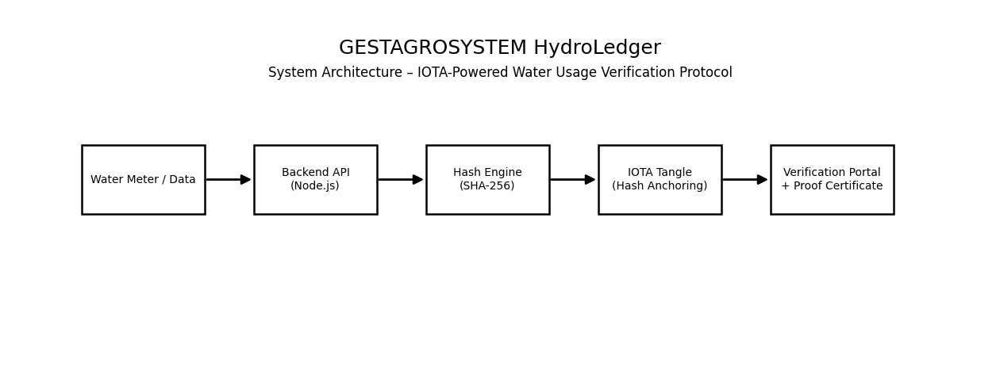

# 🌊 HydroLedger — Water Usage Verification Protocol

HydroLedger is a blockchain-based system designed to ensure **transparent, verifiable, and tamper-proof water usage tracking in agriculture**.

This MVP demonstrates how water consumption data can be:
- securely recorded
- cryptographically hashed
- anchored (simulated IOTA integration)
- verified by anyone
- transformed into a trusted digital certificate

---

## 🚀 Demo

👉 https://drive.google.com/file/d/1WfhJtg2siIn7-MeZoXN05swH6W7CnWwi/view?usp=sharing

---

## 🎯 Problem

Water misuse and lack of transparency in agriculture lead to:
- inefficient resource allocation
- lack of trust in reporting
- difficulty in regulatory compliance

---

## 💡 Solution

HydroLedger introduces:
- Proof generation for water usage
- Blockchain-style hashing for integrity
- Simulated IOTA anchoring
- Public verification system
- Certificate generation for compliance and trust

---

## ⚙️ Features

✅ Generate water usage proof  
✅ Create SHA-256 hash of data  
✅ Simulate IOTA anchor reference  
✅ Verify proof by ID or hash  
✅ Generate printable certificate  
✅ Full frontend + backend integration  

---

## 🧪 Demo Flow

1. Generate Proof  
2. View Proof Result  
3. Verify Proof  
4. View Certificate  

---

## 🖼️ Screenshots

### 📊 Dashboard

### ⚡ Generate Proof

### 📄 Proof Result

### 🔍 Verify Proof

### 🧾 Certificate

---

## 🏗️ System Architecture

HydroLedger follows a modular architecture designed for scalability and real-world integration with IoT and blockchain networks.

### 🔄 Data Flow

1. **Water Meter / Data Source**
   - Collects real-world water usage data (future IoT integration)

2. **Backend API (Node.js)**
   - Receives and processes data
   - Normalizes input
   - Generates Proof ID

3. **Hash Engine (SHA-256)**
   - Creates a cryptographic fingerprint of the data
   - Ensures data integrity and immutability

4. **IOTA Tangle (Simulated Anchoring)**
   - Stores a reference to the hash
   - Guarantees tamper-proof verification
   - Ready for real IOTA integration

5. **Verification Portal + Certificate**
   - Allows users to verify proofs
   - Displays full data transparency
   - Generates official proof certificate

---

## 🧠 How It Works

1. User inputs water usage data  
2. Backend normalizes and hashes data  
3. A unique Proof ID is generated  
4. Data is stored and "anchored" (simulated IOTA reference)  
5. Users can:
   - verify authenticity
   - generate certificates  

---

## 🔗 Blockchain Integration (MVP)

This version includes:
- cryptographic hashing (SHA-256)
- simulated IOTA anchor reference

👉 Designed for future real integration with IOTA network.

---

## 🛠️ Tech Stack

### Frontend
- Next.js
- TypeScript
- Tailwind CSS

### Backend
- Node.js
- Express
- JSON storage (MVP)

---

## 📌 Future Improvements

- Real IOTA integration  
- Wallet authentication  
- IoT sensor integration  
- Smart irrigation automation  
- AI-based water optimization  

---

## 👩‍💻 Author

**Hilaria Eduarda Jesus**  
🔗 https://www.linkedin.com/in/hilaria-jesus  

---

## 🏁 Hackathon Submission

Project built for:

**IOTA European Web3 Hackathon**

---

## ⭐ Final Note

HydroLedger is not just a prototype — it is a vision for **transparent and accountable water usage in agriculture powered by blockchain.**
